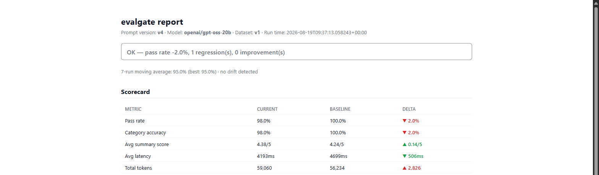
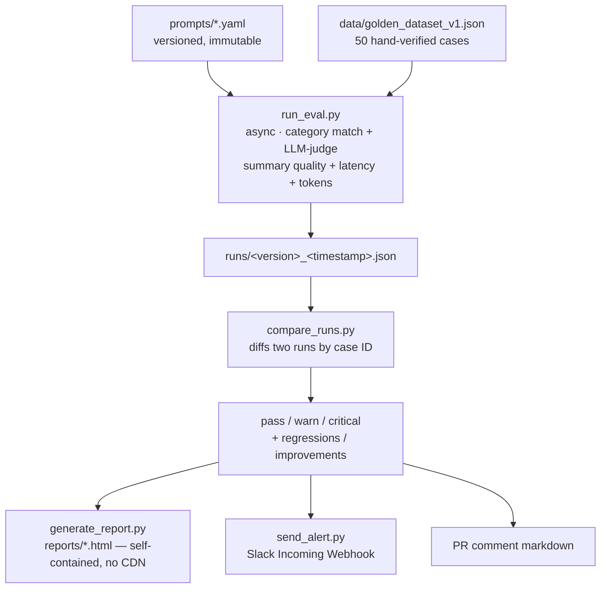

# evalgate

**CI/CD for prompts — catch LLM quality regressions before they ship.**

[](https://github.com/19himanshurane/evalgate/actions/workflows/eval.yml)

[](LICENSE)

`evalgate` runs a golden set of hand-verified test cases through an
LLM-powered feature (right now: a customer support email classifier) on
every pull request that touches `/prompts`, scores the output on more
than exact-match accuracy, diffs the result against the last known-good
run, and blocks the merge if it's a regression past a configurable
threshold. On merge, it records the new run as the baseline for the next
comparison and posts a Slack summary.

**The point isn't the classifier — it's the harness.** Swap the feature
under test and the eval/diff/alert machinery underneath doesn't change.
Most teams ship prompt changes the way code shipped before automated
testing existed: write it, eyeball the output, hope nothing broke. This
is what a test suite and a CI gate look like for a prompt instead of a
function.

## Results

Real numbers from `/runs`, not illustrative ones — each row is an actual
recorded eval run against the same 50-case golden dataset:

| Prompt | Pass rate | What changed |
|---|---|---|
| `v1` | 84.0% | Baseline. |
| `v2` | 98.0% | Fixed the biggest failure cluster: `account` vs. `billing` was ambiguous (cancelling a plan looked like a billing action), and `technical` vs. `general` was ambiguous (a compatibility question isn't a malfunction). Both boundaries made explicit in the prompt. |
| `v3` | 100.0% | Closed an edge case v2 missed: an email that *opens* with a compatibility question but goes on to describe a real malfunction should classify as `technical`, not `general`. |
| `v4` | 98.0% | Added an explicit tie-break rule for multi-issue emails (a blocking problem now outranks a side complaint). A deliberate 2-point tradeoff, not a bug — and correctly *not* flagged, since it's under the 3% warning threshold. |

That last row is the actual point of the project: the harness didn't just
watch pass rate go up, it registered a small, real cost on a later
change and made the right call not to block it.

<p align="center">
  
  <br>
  <sub>The actual self-contained HTML report generate_report.py produces for the v4 run above — no mockup, generated from a real recorded run.</sub>
</p>

It also caught real bugs, not just prompt regressions. A test PR
([#1](https://github.com/19himanshurane/evalgate/pull/1)) opened
specifically to prove the GitHub Action worked end-to-end surfaced two
CI-only failures that never showed up locally: the gitignored `reports/`
directory didn't exist on a fresh checkout, and an unset GitHub Actions
repository variable expands to `""`, not "absent," which crashed
threshold parsing. Both are fixed on `main`; see [`docs/blog_post.md`](docs/blog_post.md)
for the full writeup.

## Contents

- [How it fits together](#how-it-fits-together)
- [Project structure](#project-structure)
- [Setup](#setup)
- [Running the pipeline locally](#running-the-pipeline-locally)
- [Adding test cases to the golden dataset](#adding-test-cases-to-the-golden-dataset)
- [Adjusting thresholds](#adjusting-thresholds)
- [Running with Docker](#running-with-docker)
- [CI/CD setup](#cicd-setup)
- [Architecture decisions and why](#architecture-decisions-and-why)
- [Further reading](#further-reading)

## How it fits together



CI (`.github/workflows/eval.yml`) wires this into two triggers:

- **PR touching `/prompts`**: run eval on the changed prompt file, diff
  against whatever's currently in `/runs`, post a sticky PR comment, fail
  the check on a critical regression. Nothing is written back to the repo
  — you can push to the PR branch repeatedly without polluting history.
- **Push to `main`** (i.e. that PR just merged): re-run eval, commit the
  new run to `/runs` as the permanent new baseline, send the Slack alert.
  This is what makes the *next* PR's comparison meaningful. It also
  rewrites `prompts/ACTIVE` (see below) to point at the merged prompt.

`prompts/ACTIVE` is a one-line pointer file naming whichever prompt is
currently live (e.g. `email_classifier_v4.yaml`). `run_eval.py` and
`try_classifier.py` both default to it via `src.classifier.active_prompt_path()`
rather than a hardcoded filename — a hardcoded default silently goes
stale the moment a new version ships, since nothing forces it to be
bumped. CI keeps it in sync automatically on every merge; you should
never need to edit it by hand.

## Project structure

```
evalgate/
├── .github/workflows/eval.yml     CI: PR check + merge-time baseline recording
├── src/
│   ├── classifier.py              the feature under test
│   ├── evaluator.py               async eval runner + LLM-judge scoring
│   ├── comparator.py              run-vs-run diffing, severity classification
│   ├── drift.py                   rolling-average slow-decline detection
│   ├── alerting.py                Slack payload builder
│   ├── report.py                  self-contained HTML report generator
│   ├── dataset.py, models.py      loading + Pydantic contracts
├── prompts/                       versioned, immutable prompt YAMLs + ACTIVE pointer
├── data/golden_dataset_v1.json    50 hand-verified test cases
├── runs/                          permanent record of every evaluated run
├── run_eval.py                    CLI: run the golden dataset against a prompt
├── compare_runs.py                CLI: diff two runs, exit non-zero on critical
├── generate_report.py             CLI: build the self-contained HTML report
├── send_alert.py                  CLI: post the Slack summary
├── validate_dataset.py            dev utility: sanity-check the golden dataset
├── try_classifier.py              dev utility: manual smoke test
├── scripts/build_dataset_candidates.py   one-time dataset scaffolding script
├── docs/blog_post.md, loom_script.md     write-up + walkthrough script
└── Dockerfile
```

## Setup

```bash
git clone https://github.com/19himanshurane/evalgate.git
cd evalgate
python -m venv .venv && .venv/Scripts/activate  # or source .venv/bin/activate
pip install -r requirements.txt
cp .env.example .env
```

Fill in `.env`:

- `GROQ_API_KEY` — required. We use [Groq](https://console.groq.com/keys)
  (free tier, OpenAI-compatible API) instead of OpenAI, purely because it's
  free. If you swap providers, the only file that needs to change is
  `src/classifier.py`'s `get_client()`/`get_async_client()`. **Model
  constraint**: structured outputs (`response_format=json_schema`, which
  we rely on for guaranteed-valid category labels) only work on Groq's
  `openai/gpt-oss-20b` and `openai/gpt-oss-120b`. Other Groq models will
  reject the request outright.
- `SLACK_WEBHOOK_URL` — optional locally, required for the merge-time
  Slack alert. Create one at your Slack app's *Incoming Webhooks* page.

Sanity check the classifier works before touching the eval pipeline:

```bash
python try_classifier.py
```

## Running the pipeline locally

```bash
python run_eval.py --prompt prompts/email_classifier_v4.yaml   # writes runs/v4_<ts>.json
python compare_runs.py                                          # diffs the 2 most recent runs in /runs
python generate_report.py                                       # writes reports/report_<version>_<ts>.html
python send_alert.py                                             # posts to Slack, needs SLACK_WEBHOOK_URL
```

`compare_runs.py` and `generate_report.py` default to "the two most
recent runs in `/runs` by their own recorded timestamp," which is what
you want 95% of the time. Pass `--baseline`/`--current` explicitly if
you need to diff two specific runs out of order.

## Adding test cases to the golden dataset

`data/golden_dataset_v1.json` is the ground truth every run is scored
against — currently 50 cases (23 technical, 11 general, 9 billing, 7
account; 38 easy / 7 medium / 5 hard). Each case:

```json
{
  "id": "tc-051",
  "email": "...",
  "expected_category": "billing",
  "expected_summary": "One sentence, customer's perspective.",
  "difficulty": "easy",
  "notes": "Why this case exists / why you picked this label."
}
```

Rules that matter:

- **IDs are permanent.** Don't renumber existing cases when you add new
  ones — `tc-051` onward. Renumbering breaks case-ID matching in
  `compare_runs.py`, which is how regressions get attributed to a
  specific case rather than just "accuracy went down somewhere."
- **Write it yourself; don't generate it with an LLM.** The whole value
  of this dataset is that it's an independent, human-verified check on
  the model. If the same class of model writes both the questions and
  the answer key, you've built a mirror, not a test.
- **The best source of new cases is real failures.** When a run fails a
  case that wasn't in the dataset before (a support ticket that tripped
  up the classifier in practice, a case a teammate found manually), add
  it, with the correct label, so a future prompt change can never
  silently regress on that exact input again. This is the same instinct
  as adding a regression test when you fix a bug.
- **Deliberately include hard cases** — ambiguous ones that could
  reasonably go either way, very short inputs, typos, sarcasm, mixed
  language. Tag `difficulty` honestly and explain the reasoning in
  `notes`, especially when the "correct" label is genuinely arguable.
  Run `python validate_dataset.py` to check schema, category/difficulty
  spread, and duplicate IDs after editing.
- **Bump the dataset version** (`golden_dataset_v2.json`, updating
  `version` inside the file) if you ever change enough cases that old
  scores stop being comparable to new ones. `compare_runs.py` matches
  cases by ID across runs; it doesn't currently warn you if the dataset
  version changed between two runs you're diffing, so don't compare
  across dataset versions by hand.

## Adjusting thresholds

Pass rate deltas are classified `improved` / `ok` / `warning` (>3% drop)
/ `critical` (>8% drop) — see `src/comparator.py`. Override without a
code change:

```bash
EVAL_WARNING_THRESHOLD=0.05 EVAL_CRITICAL_THRESHOLD=0.10 python compare_runs.py
```

In CI, set these as [repository variables](../../settings/variables/actions)
(`EVAL_WARNING_THRESHOLD`, `EVAL_CRITICAL_THRESHOLD`) — not secrets,
they're not sensitive. In Docker, pass them as `-e` flags (defaults are
baked into the image via `ENV`, see `Dockerfile`).

Drift detection (`src/drift.py`) is separate and not currently
configurable via env var: it flags when the 7-run trailing average of
pass rate falls more than 5 points below its historical best, which
catches a slow bleed that no single-run diff would ever cross the
warning threshold on. If you need that configurable too, it's a small
change to `DEFAULT_WINDOW`/`DEFAULT_DRIFT_THRESHOLD` in that file.

## Running with Docker

```bash
docker build -t evalgate .
docker run --rm --env-file .env -v "${PWD}/runs:/app/runs" evalgate run_eval.py --prompt prompts/email_classifier_v4.yaml
docker run --rm --env-file .env -v "${PWD}/runs:/app/runs" evalgate compare_runs.py
```

On Windows + Git Bash specifically: `$(pwd)`/`${PWD}` gets POSIX-converted
and collides with the `-v host:container` colon syntax, silently
producing a garbage mount path instead of an error. Prefix the command
with `MSYS_NO_PATHCONV=1`, or just pass an explicit Windows path
(`-v "E:\path\to\evalgate\runs:/app/runs"`).

The image's `ENTRYPOINT` is `python`; `CMD` defaults to `run_eval.py`.
Override the argument to run any of the other scripts. Mount `/app/runs`
(and `/app/reports` if you want the HTML report on the host) so output
survives the container exiting — nothing is persisted inside the image
itself.

## CI/CD setup

Add these to the repo (Settings → Secrets and variables → Actions):

- **Secrets**: `GROQ_API_KEY`, `SLACK_WEBHOOK_URL`
- **Variables** (optional): `EVAL_WARNING_THRESHOLD`, `EVAL_CRITICAL_THRESHOLD`

For the critical-regression check to actually block merges, mark
`pr-check` as a required status check under branch protection for `main`.
GitHub Actions failing a job doesn't block anything on its own — that's
a separate setting you have to turn on.

The `record-baseline` job pushes directly to `main` using the default
`GITHUB_TOKEN` (`permissions: contents: write`). If branch protection is
configured to block *all* direct pushes with no exceptions, that push
will fail. Either allow this workflow specifically, or switch that job
to opening its own small PR instead — not implemented here since it adds
a second review step for what's meant to be a background bookkeeping
commit.

## Architecture decisions and why

**Prompts are files, not database rows or inline strings.** Versioned
YAML in `/prompts`, one immutable file per version. This is what makes
"diff two prompt versions" the same primitive as "diff two commits" —
you get git history, review, and rollback for free instead of building
prompt versioning as a bespoke feature.

**Scoring is multi-dimensional, not just category accuracy.** A prompt
change that keeps category accuracy flat but quietly makes summaries
worse, or triples latency, is still a regression. Category match is
binary and cheap to check; summary quality isn't checkable by string
equality, so it's scored by a second model acting as judge.

**The judge is a different (larger) model than the one under test**
(`openai/gpt-oss-120b` judging, `-20b` or whichever model is configured
as the classifier). Grading your own homework with the same model
under test risks correlated blind spots — a systematic misunderstanding
the classifier has could produce a judge that shares it and rates the
mistake as fine.

**Async with a small concurrency cap and retry-after-aware backoff, not
plain sequential calls or naive high concurrency.** This runs on a free
API tier with a strict tokens-per-minute budget. High concurrency
sounds faster but just produces a wall of 429s; the fix was reading the
API's own `retry-after` header rather than guessing at backoff timing.
On a paid tier with a real rate limit budget, `CONCURRENCY` in
`src/evaluator.py` is the one constant to raise.

**Comparison matches cases by ID, not by position or content.** This is
what makes "tc-026 regressed" a meaningful, stable statement across
runs instead of "row 26 in the results changed," which breaks the
moment the dataset is reordered.

**Drift detection is a separate mechanism from per-run diffing, not a
lower threshold on the same check.** A prompt that erodes by 1% every
run for ten runs straight never crosses an 8% or even 3% single-run
threshold — each step is noise-sized on its own. The rolling average in
`src/drift.py` is specifically for catching that shape of failure, which
per-run diffs structurally cannot.

**PRs never write back to the repo; merges do.** Keeps PR iteration
(push, see comment, push again) from generating throwaway commits, while
still giving every merge a permanent, comparable record in `/runs`
that the next PR diffs against.

**The golden dataset was sourced from a public Kaggle ticket dataset's
metadata (ticket type, product, subject line), not its actual ticket
text.** The raw text turned out to be broken — unsubstituted template
placeholders and garbled sentence concatenation in every single row (see
`scripts/build_dataset_candidates.py`'s docstring and git history for
specifics). Real category distribution and product variety were still
worth keeping; the actual email text and labels were written and
verified by hand against that scaffolding. Categories were re-judged
per case rather than trusting the source dataset's own type labels,
which frequently disagreed with its own more specific subject field.

## Further reading

- [`docs/blog_post.md`](docs/blog_post.md) — the full writeup: the 84% →
  100% loop, the drift-vs-diff design decision, and the two real bugs a
  test PR caught that reading the code never would have.
- [`docs/loom_script.md`](docs/loom_script.md) — a ~3-minute walkthrough
  script for demoing the pipeline end to end.

## License

[MIT](LICENSE)
